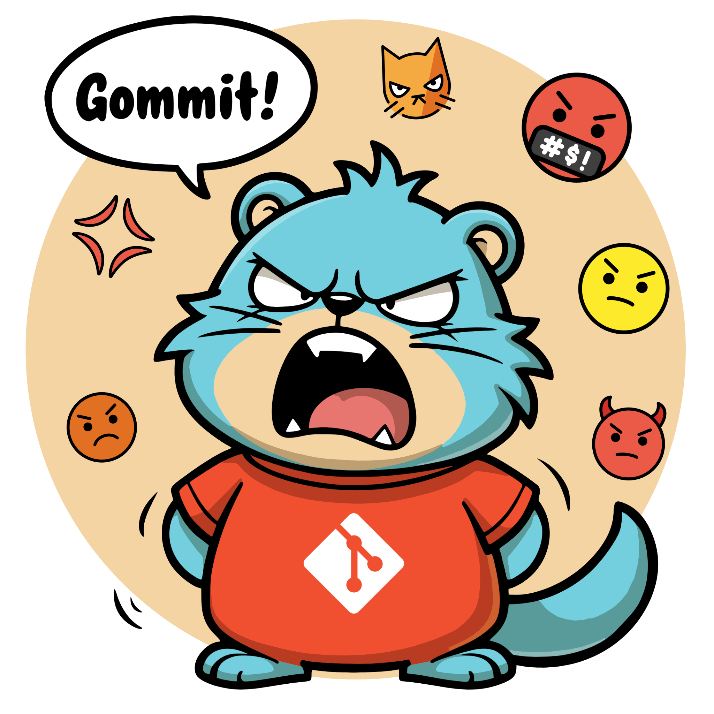

# Gommit! 

<p align="center">
  
</p>

> **Golang Conventional Commits... GoCoMmit, goddamit... Gommit!**  
Because following specs shouldn't be so **commit**-ting. Conventional Commits made easy anywhere, gommit! 💢 

Gommit! is a powerful tool for enforcing consistent commit message formats in your Git repositories. It helps teams maintain clean and informative commit histories by validating commit messages against predefined rules.

 [](https://goreportcard.com/report/github.com/moukrea/gommit/gommit)  
[](https://sonarcloud.io/summary/new_code?id=Moukrea_gommit) [](https://codecov.io/github/moukrea/gommit)   
[](https://github.com/moukrea/gommit/releases)
[](https://github.com/moukrea/gommit/releases)
[](https://github.com/moukrea/gommit/stargazers)

## Features

- Enforces the [Conventional Commits](https://www.conventionalcommits.org/) specification
- Automatically sets up in repositories with zero configuration for developers
- Cross-platform support (Linux, macOS, Windows)
- Easy integration for repository maintainers

## For Repository Maintainers

### Integrating Gommit! into Your Repository

To quickly integrate Gommit! into your repository, follow these steps:

1. Run the appropriate convenience script for your operating system:

   #### For Unix-like systems (Linux and macOS):

   If you have `curl` installed:

   ```bash
   sh -c "$(curl -L "https://raw.githubusercontent.com/moukrea/gommit/main/integration/integration.sh")"
   ```

   If you have `wget` installed:

   ```bash
   sh -c "$(wget -O- "https://raw.githubusercontent.com/moukrea/gommit/main/integration/integration.sh")"
   ```

   If you have `fetch` installed (common on FreeBSD):

   ```bash
   sh -c "$(fetch -o - "https://raw.githubusercontent.com/moukrea/gommit/main/integration/integration.sh")"
   ```

   #### For Windows:

   Run the following command in PowerShell:

   ```powershell
   powershell -ExecutionPolicy Bypass -Command "iex ((New-Object System.Net.WebClient).DownloadString('https://raw.githubusercontent.com/moukrea/gommit/main/integration/integration.ps1'))"
   ```

2. After running the convenience script, review the changes made to your repository.

3. Add and commit the new files:

   ```bash
   git add .gommit Makefile
   git commit -m "chore(hooks): integrate gommit"
   ```

4. Push the changes to your repository:

   ```bash
   git push
   ```

5. Update your repository's documentation to inform developers about Gommit. Add the following to your `README.md` or `CONTRIBUTING.md`:

   ```markdown
   ## Setting up Gommit!

   This repository uses [Gommit!](https://github.com/moukrea/gommit) to enforce consistent commit message formats. After cloning the repository, run the following command to set up Gommit:

   `make gommit-setup`

   This will download the appropriate Gommit! binary for your system and set up the necessary Git hooks.
   ```

These steps ensure that Gommit! is properly integrated into your repository and that developers have clear instructions for setting it up.

For those who prefer to set up Gommit! manually or want to understand the integration process in detail, please refer to our [Manual Integration Guide](integration/integration.md).

### What Gets Added to Your Repository

The integration tool adds the following to your repository:

- `.gommit/`: A directory containing Gommit! setup scripts for various platforms
- `Makefile`: A Makefile with a target for setting up Gommit! (or appends to your existing Makefile)

These additions ensure that Gommit! can be easily set up by developers who clone your repository.

## For Developers

When you clone a repository that has Gommit! integrated, you'll need to set it up locally. This is typically done by running:

```
make gommit-setup
```

This command will download the appropriate Gommit! binary for your system and set up the necessary Git hooks.

### Writing Commit Messages

When you make a commit, Gommit! will validate your commit message. A valid commit message should follow this format:

```
<type>[optional scope]: <description>

[optional body]

[optional footer(s)]
```

Where `<type>` is one of:

- feat: A new feature
- fix: A bug fix
- docs: Documentation only changes
- style: Changes that do not affect the meaning of the code (white-space, formatting, missing semi-colons, etc)
- refactor: A code change that neither fixes a bug nor adds a feature
- perf: A code change that improves performance
- test: Adding missing tests or correcting existing tests
- chore: Changes to the build process or auxiliary tools and libraries such as documentation generation

For example:

```
feat(user-auth): add password reset functionality

- Implement password reset form
- Add email sending service for reset links
- Update user model with reset token field

Closes #123
```

If your commit message doesn't meet the required format, Gommit! will prevent the commit and provide feedback on what needs to be corrected.

## Contributing

Contributions to Gommit! are welcome! Please see our [Contributing Guidelines](CONTRIBUTING.md) for more details.

## License

Gommit! is released under the MIT License. See the [LICENSE](LICENSE) file for details.

## Configuration

Gommit can be customized to fit your project's specific needs. You can configure various aspects of commit message validation, including:

- Header format and length
- Description case
- Body line length
- Footer format
- Breaking change enforcement

For detailed information on how to create, use, and customize the configuration file, please refer to our [Configuration Guide](CONFIG.md).

## Support

If you encounter any problems or have any questions, please [open an issue](https://github.com/moukrea/gommit/issues/new) on our GitHub repository.

Thank you for using Gommit! to keep your commit history clean and informative!

## Credits

Repository image uses [OpenMoji](https://openmoji.org/) emojis, licensed under [CC BY-SA 4.0](https://creativecommons.org/licenses/by-sa/4.0/#)

---
*Note: This project was developed with assistance from AI tools (aider.chat, OpenRouter with Claude 3.5 Sonnet, GPT-4o and GPT-o1 preview).*